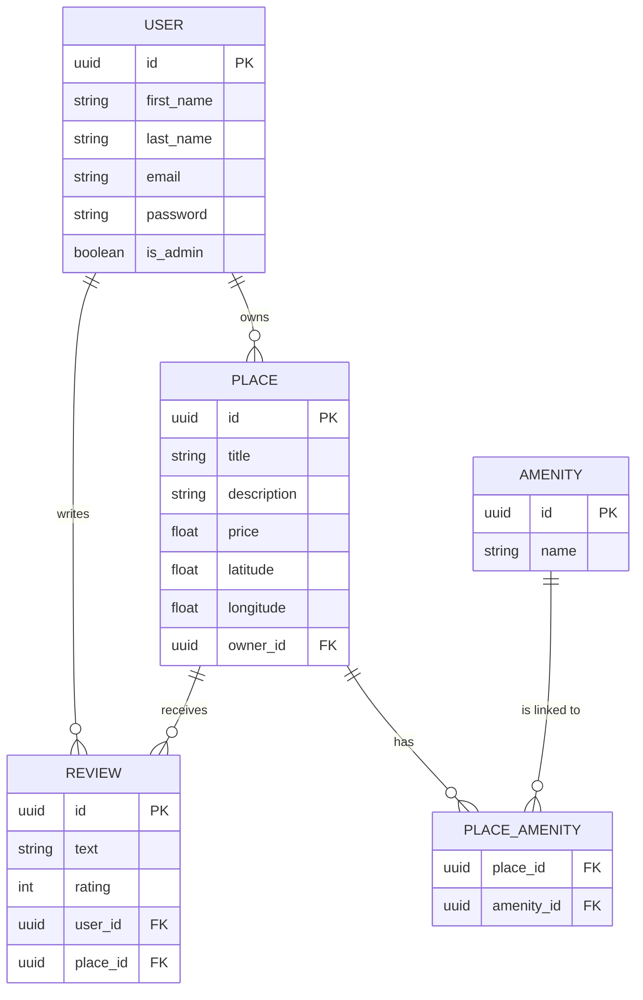

# 🏠 **Projet HBNB – Backend**

> Partie 3 du projet Holberton HBNB : Authentification, Base de données & Sécurisation des API  
> _Développé avec Flask, SQLAlchemy et JWT_
---

## 📘 Description du projet

Le projet **HBNB Backend** fait partie du programme **Holberton School** et vise à construire une API complète pour une plateforme de type **Airbnb**.  
Cette troisième partie met l’accent sur :
- 🔐 l’authentification des utilisateurs via **JWT** ;
- 🗄️ la persistance des données avec **SQLAlchemy** ;
- ⚙️ la sécurisation et la structuration des endpoints RESTful ;
- 🧩 la représentation du schéma de base de données avec **Mermaid.js**.

---

## 🎯 Objectifs du projet

### 🔐 Authentification & autorisation
- Mise en place de **Flask-JWT-Extended** pour la gestion des tokens.
- Séparation claire entre **utilisateurs** et **administrateurs**.
- Protection des endpoints selon les permissions.

### 🗄️ Intégration de la base de données
- Passage d’un stockage en mémoire à **SQLite** (dev) / **MySQL** (prod).
- Mapping des entités avec **SQLAlchemy ORM**.
- Gestion automatique des relations (One-to-Many, Many-to-Many).

### ⚙️ Opérations CRUD persistantes
- Création, lecture, mise à jour et suppression des entités.
- Validation des entrées et gestion des erreurs.
- Structure modulaire pour la maintenabilité du code.

### 🧩 Visualisation du modèle
- Diagramme entité-relation (ERD) généré en **Mermaid.js**.
- Liens clairs entre les tables `User`, `Place`, `Review`, `Amenity`, `Place_Amenity`.

---

## 🔒 Sécurisation des données utilisateur

<details>
<summary>🧠 Cliquer pour voir les détails</summary>

- **Flask-Bcrypt** : hachage sécurisé des mots de passe.  
- **Flask-JWT-Extended** : gestion des tokens d’accès et de rafraîchissement.  
- **Attribut `is_admin`** : distinction claire entre administrateurs et utilisateurs classiques.  
- **Validation stricte des entrées utilisateur** : empêche les injections SQL ou XSS.  

</details>

---

## 📂 Architecture du projet

```
organisation_hbnb/
├── app/                # Application principale Flask
├── api/                # Endpoints RESTful
├── models/             # Entités SQLAlchemy
├── services/           # Logique métier et pattern Facade
├── persistence/        # Gestion de la base de données
├── Script_test/        # Scripts et jeux de tests
├── config.py           # Configuration du projet
├── run.py              # Point d’entrée Flask
├── requirements.txt    # Dépendances Python
└── README.md           # Documentation du projet
```

---

## 💾 Base de données et ORM

Le projet utilise **SQLAlchemy** comme ORM :

| Environnement | Base de données | Objectif |
|----------------|----------------|-----------|
| 🧩 Développement | SQLite | Rapidité & simplicité |
| 🚀 Production | MySQL | Stabilité & scalabilité |

### Avantages :
- Abstraction des requêtes SQL brutes  
- Gestion simplifiée des relations  
- Compatibilité multi-SGBD  

---

## ⚙️ Installation et configuration

### 🧩 Installation des dépendances

```bash
pip install -r requirements.txt
```

ou manuellement :

```bash
pip install flask flask-restx flask-bcrypt flask-jwt-extended sqlalchemy
```

### 🚀 Lancer le serveur

```bash
python3 run.py
```

💡 *Conseil : utilisez un environnement virtuel (`python3 -m venv .venv`) pour isoler le projet.*

---

## 📊 Diagramme de la base de données (Mermaid.js)



---

## 🧪 Exemples de cas d’utilisation

### 🔑 Connexion utilisateur

```bash
curl -X POST http://127.0.0.1:5000/api/v1/login -H "Content-Type: application/json" -d '{"email": "user@example.com", "password": "password123"}'
```

### 📋 Codes de statut HTTP

| Code | Signification |
|------|----------------|
| 200  | Requête réussie |
| 301 / 302 | Redirection |
| 401  | Non authentifié |
| 403  | Accès refusé |
| 404  | Ressource non trouvée |
| 500–504 | Erreur serveur |

---

## 🧰 Tests et validation

<details>
<summary>🧾 Instructions de test</summary>

### Avant de lancer les tests :
1. Assurez-vous que la base est réinitialisée :
   ```bash
   python3 reset_db.py
   ```
2. Un **admin par défaut** est créé :
   - **Email** : `admin@hbnb.com`
   - **Mot de passe** : `admin123`
   - **is_admin** : `True`

### Tests effectués :
- Relations entre entités  
- Fonctionnement des endpoints sécurisés  
- Validation de la persistance SQLAlchemy  

</details>

---

## 👥 Auteurs du projet

👩‍💻 **Théa Prolongeau**  
👨‍💻 **Dorian Oufer**


---

## 📚 Ressources utilisées

- [📘 Flask Documentation](https://flask.palletsprojects.com/)  
- [🗄️ SQLAlchemy](https://docs.sqlalchemy.org/)  
- [🔐 Flask-JWT-Extended](https://flask-jwt-extended.readthedocs.io/)  
- [🧠 Flask-Bcrypt](https://flask-bcrypt.readthedocs.io/)  
- [🧩 Mermaid.js](https://mermaid.js.org/)  
